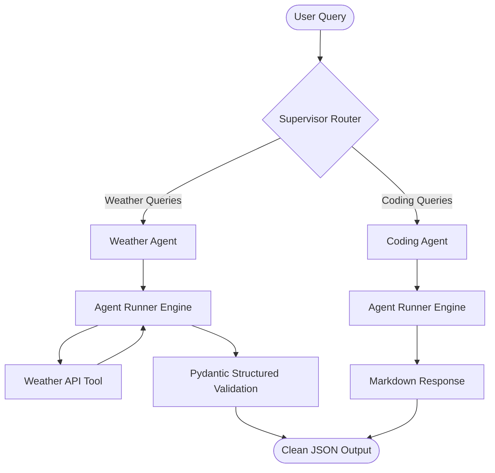
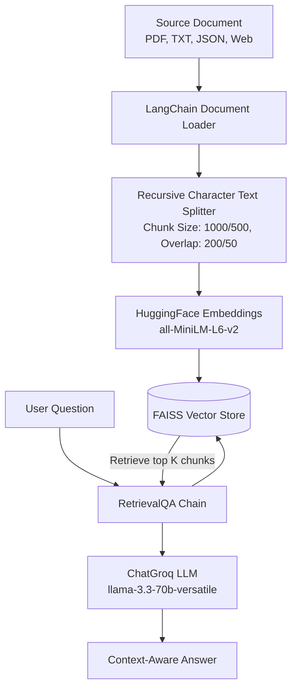

# 🧠 GenAI & Multi-Agent Systems Workshop (SISTec)

[](https://www.python.org/)
[](https://groq.com/)
[](https://github.com/langchain-ai/langchain)

Welcome to the official repository for the **GenAI and Multi-Agent Systems Workshop** at **SISTec** (Sagar Institute of Science and Technology). This repository is a comprehensive, hands-on guide designed for developers and AI engineers to transition from basic LLM integration to advanced concepts like custom agent run-loops, multi-agent orchestrations, native tool calling, and full-featured Retrieval-Augmented Generation (RAG) pipelines.

---

## 📅 Workshop Agenda Overview

| Day | Topic | Key Technologies | Core Files & Demos |
| :--- | :--- | :--- | :--- |
| **Day 1** | **Custom Agents & Multi-Agent Routing** | Python, Groq LLM, Pydantic, OpenWeatherMap API | Custom Runner class, Weather Agent, Keyword-based Supervisor Router |
| **Day 2** | **Native Tool Calling & LangChain RAG** | OpenAI SDK, LangChain, FAISS, Sentence Transformers, Browserbase | Groq Tool Calling, PDF/JSON/Web RAG loaders, API-driven Semantic Search |

---

## 📁 Repository Structure

```directory
.
├── Day_1/
│   ├── Weather_agent/
│   │   ├── agent.py               # Custom Agent class representation
│   │   ├── tool.py                # OpenWeatherMap API wrapper
│   │   ├── runner.py              # Custom Agent Run-loop with LLM interaction
│   │   ├── main.py                # Single-agent weather querying application
│   │   └── email_generatrion.py   # Draft email generation helper
│   └── Multi_Agent/
│       ├── agent.py               # Custom base Agent definition
│       ├── weather_agent.py       # Weather Agent instruction prompt
│       ├── coding_agent.py        # Coding Agent instruction prompt
│       ├── tool.py                # Helper API tools
│       ├── runner.py              # Central agent-execution engine
│       └── main.py                # Multi-Agent supervisor routing orchestrator
├── Day_2/
│   ├── GropToolCalling/
│   │   ├── tool.py                # API implementation for weather querying
│   │   ├── main.py                # Native function calling using Groq LLM and OpenAI SDK
│   │   └── requirements.txt       # Dependencies for Tool Calling demo
│   └── RAG/
│       ├── data/                  # Source files for retrieval database
│       │   ├── company.txt        # Corporate textual knowledge base
│       │   ├── company_policy.pdf # PDF policy documentation
│       │   └── sample.json        # Structured JSON data
│       ├── Rag_ReadTxt.py         # RAG pipeline for Plain Text files
│       ├── Rag_ReadPDF.py         # RAG pipeline for PDF documents
│       ├── Rag_ReadJson.py        # RAG pipeline for JSON structures
│       ├── Rag_ReadWebPage.py     # RAG pipeline for live URLs using Browserbase
│       ├── rag_api.py             # Semantic user search using external JSON APIs
│       ├── movie_recommendation.py# User post semantic matching engine
│       └── requirements.txt       # Dependencies list (LangChain, FAISS, etc.)
├── .gitignore                     # Git exclusion rules (venv, API keys)
├── requirements.txt               # Main dependencies list
└── README.md                      # Workshop Documentation (You are here)
```

---

## 🧠 Architectural Deep-Dives

### 🤖 Day 1: Multi-Agent Supervisor Routing Flow
Rather than relying on heavy agent frameworks, Day 1 implements a **Custom Runner & Agent architecture** from scratch. A **Supervisor Router** parses queries and dynamically invokes the specialized agent matching the domain.



### 📚 Day 2: Retrieval-Augmented Generation (RAG) Architecture
Day 2 explores **RAG systems** using LangChain and FAISS, enabling LLMs to answer domain-specific questions by querying locally vectorized documents.



---

## 🛠️ Setup & Installation

### 1. Clone the Repository
```bash
git clone https://github.com/lakshyasaxena07/GenAI-Workshop-SISTec.git
cd GenAI-Workshop-SISTec
```

### 2. Configure a Virtual Environment
We recommend creating a Python virtual environment (Python 3.10+):
```bash
# Create the virtual environment
python -m venv .venv

# Activate on Windows (Command Prompt)
.venv\Scripts\activate.bat

# Activate on Windows (PowerShell)
.venv\Scripts\activate.ps1

# Activate on macOS/Linux
source .venv/bin/activate
```

### 3. Install Dependencies
This project uses two separate environments depending on the modules you wish to run:

#### Option A: Day 1 & Day 2 Tool Calling Core
```bash
pip install -r requirements.txt
```

#### Option B: Day 2 RAG Environment (LangChain, HuggingFace, FAISS)
```bash
pip install -r Day_2/RAG/requirements.txt
```

### 4. Setup Environment Variables
Create a `.env` file in the root directory (and/or inside `Day_1` and `Day_2` as needed) with the following variables:
```env
GROQ_API_KEY=your_groq_api_key_here
weather_api_key=your_openweathermap_api_key_here
```
> [!IMPORTANT]
> - Obtain your Groq API key from the [Groq Console](https://console.groq.com/).
> - Obtain your weather API key from the [OpenWeatherMap Portal](https://openweathermap.org/api).
> - Never commit your `.env` file to version control. The `.gitignore` file is already preconfigured to exclude it.

---

## 🏃 Running the Demos

### 🌤️ Day 1: Custom Agents & Routers

#### Single Agent (Weather Agent)
Run a custom-built agent that fetches weather data using raw API tools and formats it using strict Pydantic parsing:
```bash
python Day_1/Weather_agent/main.py
```

#### Multi-Agent Supervisor Router
Run a keyword-based multi-agent system that delegates to either the Weather or Coding agent:
```bash
python Day_1/Multi_Agent/main.py
```

---

### 🛠️ Day 2: Native Tool Calling & RAG

#### Native Groq Tool Calling
Demonstrates how to use the official OpenAI SDK structure with Groq’s high-speed inference engine (`llama-3.3-70b-versatile`) to perform function calling:
```bash
python Day_2/GropToolCalling/main.py
```

#### Document RAG Pipelines
Run these scripts to query knowledge stored across various document formats:
```bash
# Query from a raw Text file
python Day_2/RAG/Rag_ReadTxt.py

# Query from a PDF manual
python Day_2/RAG/Rag_ReadPDF.py

# Query from structured JSON data
python Day_2/RAG/Rag_ReadJson.py

# Query live from a Webpage
python Day_2/RAG/Rag_ReadWebPage.py
```

#### API-driven Semantic Engines
Execute semantic recommendation search on mock APIs:
```bash
# RAG over external Users JSON API
python Day_2/RAG/rag_api.py

# RAG over external Posts/Movies JSON API
python Day_2/RAG/movie_recommendation.py
```

---

## 💡 Best Practices for GenAI Engineering

1. **Deterministic Structured Parsing**: Always use validation libraries like `Pydantic` to parse JSON from LLMs when output structure is critical for downstream systems.
2. **Chunk Overlap**: When setting up a vector search pipeline, maintain a moderate chunk overlap (e.g., 10-20% of chunk size) to prevent contextual loss at boundaries.
3. **API Rate Limiting**: Groq offers high throughput, but you should handle rate limit exceptions gracefully in production settings.
4. **Environment Isolation**: Separate package environments if there are conflicting dependency requirements between lightweight agents and heavyweight embedding models.

---

## 🤝 Contributing
Contributions, suggestions, and feedback are always welcome! Feel free to raise issues or create pull requests.

Developed during the **SISTec GenAI Workshop**. Made with ❤️ and 🤖.
