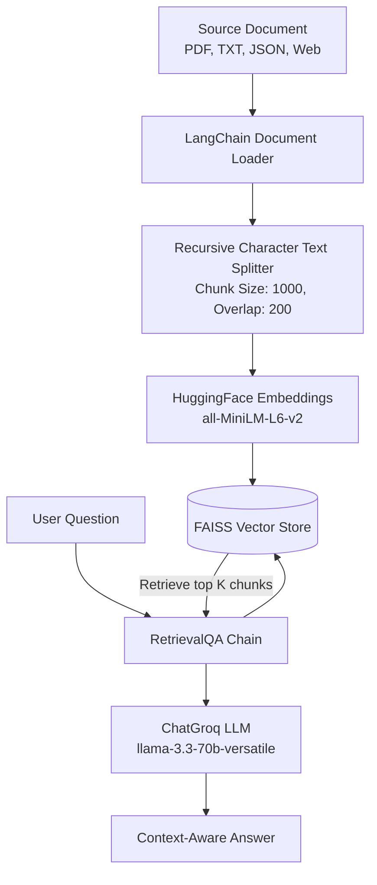
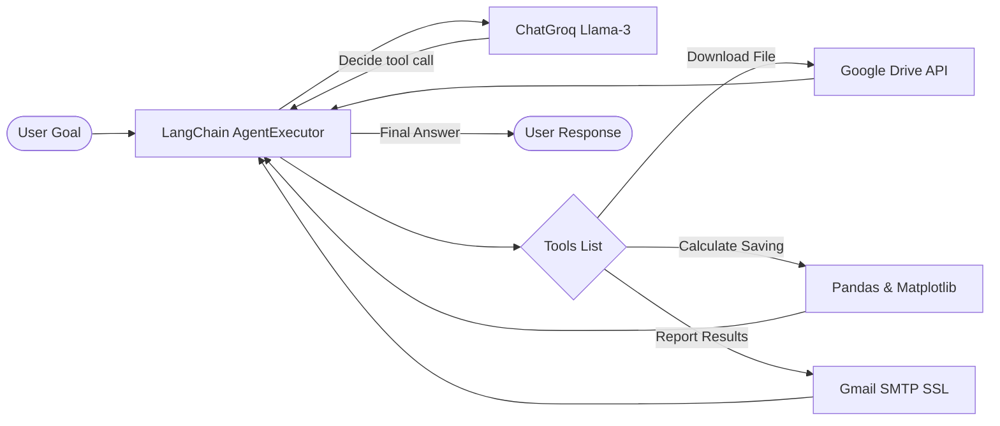

# 🧠 GenAI, RAG & Autonomous Multi-Agent Workshop (SISTec)

[](https://www.python.org/)
[](https://groq.com/)
[](https://github.com/langchain-ai/langchain)

Welcome to the official repository for the **GenAI, RAG, and Autonomous Multi-Agent Systems Workshop** at **SISTec** (Sagar Institute of Science and Technology). This project contains the complete codebase, data inputs, and conceptual presentations spanning from basic agent run-loops to production-grade Retrieval-Augmented Generation (RAG) and stateful autonomous workflow agent executors.

---

## 📅 Workshop Agenda Overview

| Day | Topic | Key Technologies | Demos & Codebases |
| :--- | :--- | :--- | :--- |
| **Day 1** | **Custom Agents & Supervisor Routing** | Python, Groq LLM, Pydantic, OpenWeatherMap API | Custom Runner class, Weather Agent, Keyword-based Supervisor Router |
| **Day 2** | **Native Tool Calling & LangChain RAG** | OpenAI SDK, LangChain Loaders, FAISS, Sentence Transformers, Browserbase | Groq Native Tool Calling, TXT/PDF/JSON/Web RAG pipelines |
| **Day 3** | **Autonomous Workflow Agents** | LangChain `AgentExecutor`, Matplotlib, Pandas, SMTP Email SSL | AI Financial Advisor (CSV to Chart), Advanced Calculator Agent, Google Drive CSV Sales Analyzer with Email Reporting |

---

## 📁 Repository Structure

```directory
.
├── Day_1/
│   ├── Weather_agent/
│   │   ├── agent.py               # Custom Agent class representation
│   │   ├── tool.py                # OpenWeatherMap API wrapper
│   │   ├── runner.py              # Custom Agent Run-loop with LLM interaction
│   │   ├── main.py                # Single-agent weather querying application
│   │   └── email_generatrion.py   # Draft email generation helper
│   └── Multi_Agent/
│       ├── agent.py               # Custom base Agent definition
│       ├── weather_agent.py       # Weather Agent instruction prompt
│       ├── coding_agent.py        # Coding Agent instruction prompt
│       ├── tool.py                # Helper API tools
│       ├── runner.py              # Central agent-execution engine
│       └── main.py                # Multi-Agent supervisor routing orchestrator
├── Day_2_&_3/
│   ├── Explaination_PPTXs/        # Conceptual lecture presentations
│   │   ├── GenAI_LLM_LangChain_RAG_Agents.pptx
│   │   ├── RAG_Scenarios_Components (1).pptx
│   │   └── RAG_Scenarios_Components.pptx
│   ├── GropToolCalling/
│   │   ├── tool.py                # OpenWeatherMap API tool definition
│   │   ├── main.py                # Native function calling using Groq LLM & OpenAI SDK
│   │   └── requirements.txt       # Dependencies for Tool Calling demo
│   └── RAG/
│       ├── data/                  # Source files for RAG & Agent queries
│       │   ├── bank_data.csv      # Dummy transactions dataset
│       │   ├── company.txt        # Corporate text knowledge base
│       │   ├── company_policy.pdf # PDF policy documentation
│       │   ├── sample.csv         # Small CSV for general agent
│       │   └── sample.json        # Structured sample JSON
│       ├── 2_Rag_ReadTxt.py       # RAG pipeline for Plain Text files
│       ├── 2_Rag_ReadPDF.py       # RAG pipeline for PDF documents
│       ├── 2_Rag_ReadJson.py      # RAG pipeline for JSON structures
│       ├── 2_Rag_ReadWebPage.py   # RAG pipeline for live URLs using Browserbase
│       ├── 2_rag_api.py           # Semantic API user query system
│       ├── 2_movie_recommendation.py # RAG matching over external post APIs
│       ├── 3_AI_Financial_Advisor.py # Autonomous tool-calling financial assistant
│       ├── 3_langchain_agent.py   # General math, date & CSV utility agent
│       ├── 3_sales_Analyzer.py    # Downloads, analyzes sales data & emails plots
│       ├── sales_data.csv         # Downloaded sales CSV
│       ├── sales_chart.png        # Generated sales visual trend
│       └── requirements.txt       # RAG & Day 3 dependencies (LangChain, FAISS, Pandas, etc.)
├── .gitignore                     # Git exclusion rules (.venv, API keys, credentials)
├── requirements.txt               # Day 1 main dependencies list
└── README.md                      # Workshop Documentation (You are here)
```

---

## 🧠 Architectural Deep-Dives

### 🤖 Day 1: Multi-Agent Supervisor Routing Flow
Implements a lightweight **Custom Runner & Agent architecture** from scratch. A supervisor routes the prompt based on keyword parsing to either the Weather or Coding agent.


### 📚 Day 2: Retrieval-Augmented Generation (RAG) Architecture
Loads and parses files (PDF, JSON, TXT, Web URLs) into structured chunks, embeds them via `sentence-transformers/all-MiniLM-L6-v2`, and retrieves relevant context through FAISS.



### ⚙️ Day 3: Autonomous Workflow Agent Loop (LangChain create_tool_calling_agent)
Features goal-driven executors (`AgentExecutor`) that execute loops to select and apply python tools sequentially until the target is resolved.



---

## 🛠️ Setup & Installation

### 1. Clone the Repository
```bash
git clone https://github.com/lakshyasaxena07/GenAI-Workshop-SISTec.git
cd GenAI-Workshop-SISTec
```

### 2. Configure a Virtual Environment
We recommend creating a Python virtual environment (Python 3.10+):
```bash
# Create the virtual environment
python -m venv .venv

# Activate on Windows (Command Prompt)
.venv\Scripts\activate.bat

# Activate on Windows (PowerShell)
.venv\Scripts\activate.ps1

# Activate on macOS/Linux
source .venv/bin/activate
```

### 3. Install Dependencies
This project uses separate requirements files depending on the day's curriculum:

#### Day 1 & Day 2 Tool Calling Core
```bash
pip install -r requirements.txt
```

#### Day 2 & 3 RAG and Autonomous Agent Environment
Installs LangChain, FAISS Vector Store, Matplotlib, Pandas, HuggingFace embeddings, and extra dependencies:
```bash
pip install -r Day_2_&_3/RAG/requirements.txt
```

### 4. Setup Environment Variables
Create a `.env` file in the root directory (or inside `Day_1` and `Day_2_&_3/RAG` as needed) with the following variables:
```env
GROQ_API_KEY=your_groq_api_key_here
weather_api_key=your_openweathermap_api_key_here
EMAIL_USER=your_gmail_address_here
EMAIL_PASSWORD=your_gmail_app_password_here
```
> [!IMPORTANT]
> - **Groq Key**: Obtain from the [Groq Console](https://console.groq.com/).
> - **Weather Key**: Obtain from the [OpenWeatherMap Portal](https://openweathermap.org/api).
> - **SMTP Mail**: If utilizing the email reporting tool, ensure `EMAIL_USER` is your Gmail address and `EMAIL_PASSWORD` is an active Gmail App Password (not your primary password). Keep security high by not committing `.env`!

---

## 🏃 Running the Demos

### 🌤️ Day 1: Custom Agents & Routers

#### Single Agent (Weather Agent)
```bash
python Day_1/Weather_agent/main.py
```

#### Multi-Agent Supervisor Router
```bash
python Day_1/Multi_Agent/main.py
```

---

### 🛠️ Day 2: Native Tool Calling & RAG Pipelines

#### Native Groq Tool Calling
```bash
python Day_2_&_3/GropToolCalling/main.py
```

#### RAG Document Loaders
```bash
# Plain Text RAG
python Day_2_&_3/RAG/2_Rag_ReadTxt.py

# PDF Document RAG
python Day_2_&_3/RAG/2_Rag_ReadPDF.py

# JSON Structure RAG
python Day_2_&_3/RAG/2_Rag_ReadJson.py

# Webpage scraping URL RAG
python Day_2_&_3/RAG/2_Rag_ReadWebPage.py
```

#### RAG over External API Mock Data
```bash
# RAG querying JSONPlaceholder Users list
python Day_2_&_3/RAG/2_rag_api.py

# RAG recommendation querying DummyJSON posts list
python Day_2_&_3/RAG/2_movie_recommendation.py
```

---

### ⚙️ Day 3: Autonomous Workflow Agents (LangChain AgentExecutor)

#### 💵 AI Financial Advisor
An autonomous advisor agent that parses a credit/debit transaction log, plots category breakdowns, suggests savings corrections, and exports a text report.
```bash
python Day_2_&_3/RAG/3_AI_Financial_Advisor.py
```

#### 🧮 General LangChain Tool Agent
A simple utility agent resolving equations, calculating live times, and reading column averages of csv logs.
```bash
python Day_2_&_3/RAG/3_langchain_agent.py
```

#### 📊 Sales Trend & Email reporter
Downloads a CSV dataset from a Google Drive URL, analyzes standard deviations/averages, saves a visual line trend chart (`sales_chart.png`), and pushes the chart via Gmail SMTP SSL to the target email.
```bash
python Day_2_&_3/RAG/3_sales_Analyzer.py
```

---

## 💡 Best Practices for GenAI Engineering

1. **Structured Parser Guardrails**: Use `Pydantic` validation or native function schemas with LLMs when output structure is critical for downstream API integrations.
2. **Context Compression & Chunks**: Keep chunk overlap at roughly 10-20% of your total chunk size to preserve semantic relationships across boundaries.
3. **Agent Loop Loop-Protection**: When using `AgentExecutor`, set standard iteration limits (`max_iterations`) to prevent infinite tool calling loops when LLMs face failed tool results.
4. **App Password Encryption**: Never place raw emails or plain SMTP credentials inside project source code; keep them isolated strictly inside your locally excluded `.env` file.

---

## 🤝 Contributing
Contributions, suggestions, and feedback are welcome! Feel free to raise issues or open pull requests.

Developed during the **SISTec GenAI Workshop**. Made with ❤️ and 🤖.
